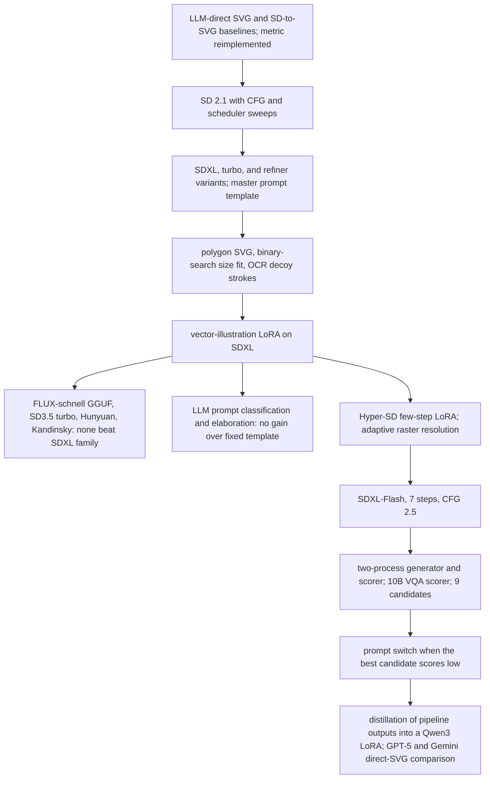

# Drawing with LLMs: Text-to-SVG Under a Fixed Fidelity Metric

An applied research program on generating SVG illustrations from short text descriptions, scored by a fixed vision-language metric with a hard file-size cap. The deliverable is inference code, not weights: a self-scoring generate-select-vectorize pipeline that runs inside the evaluation sandbox. This repository records the method: metric reimplementation, model sweeps, vectorization engineering, candidate selection, and the experiment lineage.

## 1. Problem

| | |
|---|---|
| Task | One text description in, one SVG out: 384 x 384, at most 10,000 characters, restricted element and attribute set, no text or lettering |
| Metric | Harmonic mean of a VQA score (PaliGemma-2 answering multiple-choice questions about the rendered image) and a CLIP aesthetic score, weighted toward VQA, multiplied by an OCR penalty for any detected characters. Scoring happens after defensive crops, JPEG passes, and filters |
| Deliverable | A package exposing `Model.predict(description)`, run offline on two T4 GPUs under a wall-clock budget for the hidden test set |
| Data | Fifteen public descriptions with their questions; the test questions are hidden |
| Compute | Kaggle dual-T4 kernels for scored runs; a local single-GPU workstation for pipeline development |

The protocol originated in a public challenge, which fixed the metric and constraints.

## 2. Method

1. **Metric first.** The scorer was reimplemented locally so that every candidate image can be scored before vectorization and after it, separating generation quality from conversion loss (`03_eval/`).
2. **Validation beyond fifteen rows.** Descriptions and multiple-choice questions were synthesized with an LLM to build a 100-description validation set, later a 644-description training set, and local runs report train, validation, and pooled scores side by side (`01_data/`).
3. **One variable per submission.** Backbone, scheduler, step count, guidance, resolution, prompt template, candidate count, and scorer size were changed one at a time, with the public score recorded against each configuration (`study/2025_DLLM.xlsx`).
4. **Self-scoring selection.** Because the test questions are hidden, questions are synthesized from the description's noun phrases, and the pipeline scores its own candidates with the metric's VQA and aesthetic models, keeping the best of N.
5. **Vectorization as an optimization problem.** The bitmap-to-SVG step targets the size cap directly: polygon output, binary search on the tracer's merge threshold, and raster resolution chosen from the image's color entropy.
6. **Budget-aware orchestration.** Generation and scoring run as separate processes on separate GPUs, joined by queues, so that scoring overlaps generation and the candidate count can be tuned to the time limit.

## 3. Lineage

Twenty-nine notebooks in `study/`, one per iteration. The pivotal steps:



## 4. Findings

1. **Direct LLM generation of SVG scored lowest.** Instruction-tuned LLMs writing SVG from text landed near the floor of the metric; rendering a bitmap and vectorizing it overtook them within the first diffusion sweep and stayed ahead. `03_eval/dllm_llm_eval.ipynb`
2. **The size cap, not the generator, bounded fidelity.** Emitting polygons instead of paths, stripping headers and namespaces, and binary-searching the tracer's layer threshold to land just under 10,000 characters gave more visible detail than any backbone change. `02_pipeline/Utility/dllm_utils.py`
3. **Raster resolution should follow color entropy.** Rich images vectorize better at 128 px, where each polygon is short and more colors fit under the cap; flat images keep 384 px. The mapping uses LAB-channel entropy. Same file.
4. **Candidates beat steps.** Under the time budget, distilled few-step models producing nine candidates for self-scored selection outperformed slower schedules producing three. SDXL-Flash at seven steps with low guidance was the final generator.
5. **The scorer must match the metric.** Selecting with the metric's own 10B VQA model raised the leaderboard score over selection with a smaller stand-in; questions synthesized from noun phrases were sufficient, and adding more of them hurt.
6. **OCR penalties are avoidable by design.** A negative prompt against text and two faint letter-shaped strokes in the corners kept the OCR term at one on nearly every sample. `02_pipeline/Utility/dllm_utils.py`
7. **Prompt engineering by LLM did not pay.** Classifying descriptions and elaborating them per category with a small Qwen3 or Gemma model scored below a single fixed template; the small models copied few-shot examples literally. `study/250511_dllm_flux.ipynb`
8. **Post-hoc image enhancement hurt.** LAB saturation and contrast equalization before vectorization dropped the score sharply; SDXL refiner stages and 1024 px generation added time without gain. `study/2025_DLLM.xlsx`
9. **Runtime is a first-class constraint.** A large share of submissions failed on wall-clock or memory limits; the two-process design and per-model candidate budgets were what made the highest-scoring configurations submittable.
10. **Distillation into an LLM is feasible but not competitive.** A Qwen3 LoRA trained on pipeline-generated SVGs, and frontier LLMs prompted directly, were evaluated on the same metric against the diffusion pipeline. `00_resource/submission/SD-LLM/`

## 5. Repository

```
00_resource/   models, third-party repos, reference notebooks, and the final submission packages
01_data/       competition rows, synthesized validation and training sets, prompt pools, target images
02_pipeline/   the inference package: generator and scorer workers, vectorizer, metric, requirements
03_eval/       metric reimplementation, scorer-producer evaluation notebook, metric studies
study/         one notebook per iteration; the score tracker
```

Read in this order: `03_eval/svg-image-fidelity.ipynb`, `study/2025_DLLM.xlsx`, then `02_pipeline/Utility/`.

## 6. Technology Stack

| Layer | Stack |
|---|---|
| Image generation | Diffusers pipelines for SD 2.1, SDXL base, turbo, and refiner, SDXL-Flash, SD3.5 medium and large-turbo, HunyuanDiT, Kandinsky 2.2, and FLUX.1-schnell; Hyper-SD few-step LoRAs; a vector-illustration style LoRA; DDIM and DPM-Solver schedulers; TAESD decoders; fp16 with torch.compile |
| Quantized loading | GGUF Q2 FLUX transformer, NF4 T5 encoder, 8-bit and 4-bit bitsandbytes for PaliGemma-2 and Qwen3 |
| Scoring and selection | PaliGemma-2 10B for VQA and OCR, CLIP ViT-L/14 with a linear aesthetic head, spaCy noun-chunk question synthesis, the metric's image-processing chain reproduced |
| Vectorization | vtracer polygon mode, path-to-polygon rewriting, binary search on layer threshold, LAB entropy resolution mapping, scikit-image and OpenCV |
| Orchestration | Python multiprocessing with a manager queue per stage, one CUDA device per process, Kaggle package gateway |
| Prompting | Qwen3-1.7B and Gemma-3-1B for prompt classification and elaboration; vLLM for question generation experiments |
| LLM track | Transformers Trainer with PEFT LoRA on Qwen3, assistant-only loss masking, torchrun DDP; API harnesses for GPT-5, Gemini, and other providers |
| Data | pandas over CSV and Parquet; Parti prompts and COCO captions as prompt pools; LLM-synthesized validation questions |

## 7. Disclaimer

Disclosed: methodology, the inference package, every iteration notebook with its local results, the score tracker with the public score of each submitted configuration, and the final submission packages.

Copyright © 2026 Jerry Huang. All rights reserved.
